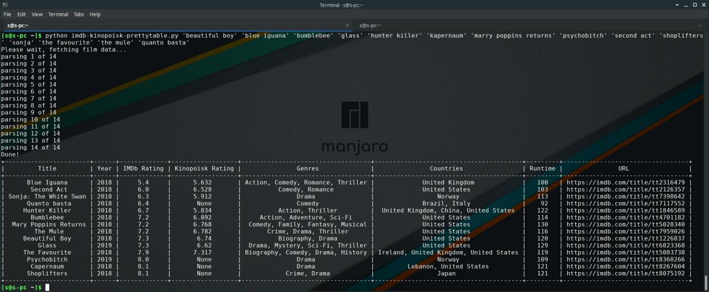

This repo is for the kinomaniacs. If you watch films frequently and often it's hard to choose for you the correct film, just grab a list of currently shown films in the cinema or maybe your own list of the films that you would like to see. Give this list to the python script and get recommendations in less than a minute. Easy as that!

Also, you can use this code to make different output: CSV/TSV and others, too (thanks to PrettyTable). Review its documentation for this. And you can use this repo if you want to learn a bit of python, or maybe something about PrettyTable or IMDb / Kinopoisk API.

# Requirements
* Python 3 (probably will still work with python 2, but you'll have to manage to rewrite some stuff)
* IMDb-py library - it's used to connect to IMDb
* (optional, but recommended) PrettyTable library - it's used to display results in a pretty table :)
* (optional) Kinopoisk library - it's used to fetch rating results also from Kinopoisk website
* git - to clone this repo
* internet and PC :D - to clone the repo and connect to IMDb/Kinopoisk

# Installation
I'm not covering installation of Python 3 here. It's already installed in most of the Linux distributions. Please google if you need help in installation of Python.

Please choose whenever you like to install (minimal, normal or full)
* Minimal: `sudo pip install IMDbpy` - this will install only IMDb python library
* Normal: `sudo pip install IMDbpy PrettyTable` - this installes IMDb and PrettyTable
* Full: `sudo pip install IMDbpy PrettyTable kinopoiskpy` - this will install all 3 tools (IMDb, PrettyTable and Kinopoisk libraries)

# What are the files here?
There are 3 python files in there:
* imdb-plaintext.py - to run it, you need only python 3 and IMDb library installed (minimal installation)
* imdb-prettytable.py - to run it, you need python 3, IMDb and PrettyTable installed (normal installation)
* imdb-kinopoisk-prettytable.py - to run it, you need all tools from the requirements (full installation)

# How to run?
That's probably the easiest. First, clone the repo (if you don't have git installed, for ubuntu just do: `sudo apt install git`):
`git clone https://github.com/sxiii/kinoparser`

Ok, the scripts should have been downloaded. Now let's check them:
`cd kinoparser && ls`

It should show you 3 python scripts (imdb-plaintext.py, imdb-prettytable.py and imdb-kinopoisk-prettytable.py). In this case everything is corrent and we're already in the scripts directory, so just run them in linux CLI:
`python ./name-of-the-choosen-script.py`

For example, for full installation, run:
* `python ./imdb-kinopoisk-prettytable.py`
For normal installation, run:
* `python ./imdb-prettytable.py`
For minimal installation, run:
* `python ./imdb-plaintext.py`
Or, if you have python 2 installed as default python interpretator, then
`python3 ./name-of-the-choosen-script.py` - edit this accordingly.

# Manipulating data
You could easily remove or add data that you need/don't need. You have to do it every time only in two places: in the heading (`t.field_names`), and in the print row (`t.add_row`). If you would like to add your own, please read the IMDBpy docs here: https://imdbpy.readthedocs.io and Kinopoisk help here: https://github.com/ramusus/kinopoiskpy

# Roadmap / Further development
* improve the speed of loading data
* make it possible to give file input with comma/tab/newline separated list of films
* make the script parse some popular websites with films by itself

# How to contribute / Issues
If you have any questions, problems, errors, issues, and cannot google them out (so they are related to the kinoparser source code), please create a github issue and show your errors etc.

If you want to contribute some improvement feel free to make a pull request. Your contribution will be mentioned in the project.
